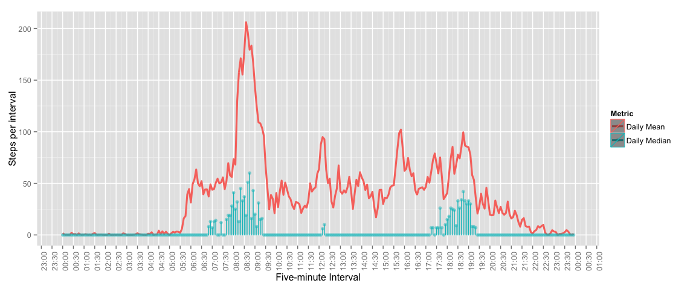

# Reproducible Research: Peer Assessment 1
Peter Nelson  
October 14, 2014  

<br>
<br>

### Required packages

Import all packages used by the analysis...


```r
library(plyr)
library(ggplot2)
library(grid)
library(gridExtra)
library(scales)
```

<br>
<br>

### Loading and preprocessing the data

Set working directory, load the data...


```r
setwd("/Users/peter.nelson/Documents/Coursera/jhds-05-repro")
steps_df <- read.csv("activity.csv")
```

Create a nice posix datetime column from the encoded date plus five-minute 'interval', also make a nice time-interval column where date is always constanct. Note that sprintf just left-pads with leading zeros...


```r
steps_df$period        <- strptime(paste(steps_df$date, sprintf("%04d", steps_df$interval)), format="%Y-%m-%d %H%M")
steps_df$time_interval <- strptime(paste('0000-01-01' , sprintf("%04d", steps_df$interval)), format="%Y-%m-%d %H%M")
```

<br>
<br>

### What is mean total number of steps taken per day?

Summarize the data by date, various stats...


```r
steps_by_date_df <- ddply(.data = steps_df, .variables = "date", .fun = summarise,
                               total = sum(steps,  na.rm = TRUE),
                               count = sum(!is.na(steps)),
                               interval_mean = mean(steps, na.rm = TRUE),
                               interval_median = median(steps, na.rm = TRUE)
                               )
```

<br>

Plot a histogram of steps per day...


```r
numBreaks <- nclass.FD(steps_by_date_df$total)
binWidth <- max(steps_by_date_df$total) / numBreaks
breakSequence <- round(seq(0,  max(steps_by_date_df$total), binWidth))

p01 <- ggplot() +
    scale_x_continuous(breaks = breakSequence, labels = comma) +
    theme(axis.text.x = element_text(angle = 90, hjust = 1)) +
    xlab("Steps per day") +
    ylab("Number of days") +
    layer(
      data=steps_by_date_df,
      mapping = aes(x = total, y = ..count..),
      geom = "histogram",
      geom_params=list(colour = "darkgreen", fill = "white"),
      stat = "bin",
      stat_params=list(binwidth = binWidth),
      position=position_identity()
    )
p01
```


<br>


```r
x <- round(mean(steps_by_date_df$total))
```
Mean steps per day, x = 9354


```r
x <- round(median(steps_by_date_df$total))
```
Median steps per day, x = 10395

<br>
<br>

### What is the average daily activity pattern?

Summarize the steps-taken data by time of day, sum/mean/median...

```r
steps_by_timeofday_df <- ddply(.data = steps_df, .variables = "time_interval", .fun = summarise,
                               total = sum(steps,  na.rm = TRUE),
                               count = sum(!is.na(steps)),
                               daily_mean = mean(steps, na.rm = TRUE),
                               daily_median = median(steps, na.rm = TRUE)
                               )
```

Plot a line chart of mean (and median) steps per five-minute interval. Note that the assignment did not call for a dual-line chart of both mean and median, but I found it to be interesting...

```r
p02 <- ggplot(data=steps_by_timeofday_df) +
    scale_x_datetime(breaks = pretty_breaks(n=288/6), label = date_format("%H:%M")) +
    theme(axis.text.x = element_text(angle = 90, hjust = 1)) +
    xlab("Five-minute Interval") +
    ylab("Steps per interval") +
    scale_colour_discrete(name = "Metric") +
    layer(
      mapping=aes(x = time_interval, y = daily_mean,  colour = 'Daily Mean'),
      stat="identity",
      stat_params=list(),
      geom="line",
      geom_params=list(size = 1.1),
      position=position_identity()
    ) +
    layer(
      mapping=aes(x = time_interval, y = daily_median, colour = 'Daily Median'),
      stat="identity",
      stat_params=list(),
      geom="point",
      geom_params=list(alpha=0.5, size = 2),
      position=position_identity()
    ) +
    layer(
      mapping=aes(x = time_interval, y = daily_median, colour = 'Daily Median'),
      stat="identity",
      stat_params=list(),
      geom="bar",
      geom_params=list(width = 1.0, alpha=0.5),
      position=position_identity()
    )
p02
```

 


```r
x <- as.character(steps_by_timeofday_df$time_interval[which.max(steps_by_timeofday_df$daily_mean)], '%H:%M')
```
Peak time of day for stepping, based on mean, x = 08:35


```r
x <- as.character(steps_by_timeofday_df$time_interval[which.max(steps_by_timeofday_df$daily_median)], '%H:%M')
```
Peak time of day for stepping, based on median, x = 08:45

<br>
<br>

Although this wasn't technically part of the assignment, here I plot a histogram of steps per five-minute interval...

```r
numBreaks <- nclass.FD(steps_by_timeofday_df$total)
binWidth <- max(steps_by_timeofday_df$total) / numBreaks
breakSequence <- round(seq(0,  max(steps_by_timeofday_df$total), binWidth))

p03 <- ggplot() +
    scale_x_continuous(breaks = breakSequence, labels = comma) +
    theme(axis.text.x = element_text(angle = 90, hjust = 1)) +
    xlab("Steps per Five-Minute Interval") +
    ylab("Number of intervals having <n> steps\n(total = 288 intervals per day)") +
    layer(
      data=steps_by_timeofday_df,
      mapping = aes(x = total, y = ..count..),
      geom = "histogram",
      geom_params=list(colour = "darkgreen", fill = "white"),
      stat = "bin",
      stat_params=list(binwidth = binWidth),
      position=position_identity()
    )
p03
```


<br>
<br>

### Imputing missing values


```r
x <- sum(is.na(steps_df$steps))
```
Count of rows having NA value, i.e. missing value, for steps, x = 2304

<br>

Build a new dataset, interpolating missing values with the mean for that time period. Recall that `steps_by_date_df` is a summary by `time_interval`, of mean, median, etc...


```r
imputed_steps_df <- steps_df
for (i in 1:nrow(imputed_steps_df)) {
  if (is.na(imputed_steps_df[i, 'steps'])) {
    interval <- imputed_steps_df[i, 'time_interval']
    val_at_that_time <- subset(steps_by_timeofday_df, time_interval == interval)$daily_mean
    imputed_steps_df[i, 'steps'] <- val_at_that_time
  }
}
```

Summarize the steps-taken data by time of day, sum/mean/median, on the dataset containing imputed values where data were absent...


```r
imputed_steps_by_date_df <- ddply(.data = imputed_steps_df, .variables = "date", .fun = summarise,
                               total = sum(steps,  na.rm = TRUE),
                               count = sum(!is.na(steps)),
                               interval_mean = mean(steps, na.rm = TRUE),
                               interval_median = median(steps, na.rm = TRUE)
                               )
```

Plot a histogram of the imputed dataset...


```r
numBreaks <- nclass.FD(imputed_steps_by_date_df$total)
binWidth <- max(imputed_steps_by_date_df$total) / numBreaks
breakSequence <- round(seq(0,  max(imputed_steps_by_date_df$total), binWidth))

p04 <- ggplot() +
    scale_x_continuous(breaks = breakSequence, labels = comma) +
    theme(axis.text.x = element_text(angle = 90, hjust = 1)) +
    xlab("Steps per day") +
    ylab("Number of days") +
    layer(
      data=imputed_steps_by_date_df,
      mapping = aes(x = total, y = ..count..),
      geom = "histogram",
      geom_params=list(colour = "darkgreen", fill = "white"),
      stat = "bin",
      stat_params=list(binwidth = binWidth),
      position=position_identity()
    )
p04
```


<br>


```r
x <- round(mean(imputed_steps_by_date_df$total))
```
Mean imputed-steps per day, x = 10766


```r
x <- round(median(imputed_steps_by_date_df$total))
```
Median imputed-steps per day, x = 10766

Note that the median steps per day is equal to the mean. This is in fact correct, and not terribly surprising since we used the mean in so many rows, and those rows were always all rows for an entire day, making the days with any missing data all equal, and thereby over-representing that one value in the daily summary dataset. Frankly, given that structure, it makes little sense to do any imputation, and more sense to simply discard all those days where no data exists. But that wasn't the assignment.

<br>
<br>

### Are there differences in activity patterns between weekdays and weekends?

Create a new factor variable in the dataset with two levels – “weekday” and “weekend” indicating whether a given date is a weekday or weekend day...


```r
steps_df$weekend_flag <- factor(weekdays(steps_df$period) %in% c("Saturday", "Sunday"), labels=c("Weekday", "Weekend"))
```

Summarize the steps-taken data by time-of-day and weekday/weekend status...

```r
steps_by_timeofday_and_weekend_df <-
    ddply(.data = steps_df, .variables = c("time_interval", "weekend_flag"), .fun = summarise,
                                total = sum(steps,  na.rm = TRUE),
                                count = sum(!is.na(steps)),
                                daily_mean = mean(steps, na.rm = TRUE),
                                daily_median = median(steps, na.rm = TRUE))
```

Plot charts comparing weekday versus weekend activity. Mean-steps per five-minute interval.


```r
p05 <- ggplot(data=steps_by_timeofday_and_weekend_df) +
    scale_x_datetime(breaks = pretty_breaks(n=288/6), label = date_format("%H:%M")) +
    theme(axis.text.x = element_text(angle = 90, hjust = 1)) +
    xlab("Five-minute Interval") +
    ylab("Steps") +
    labs(title = "Mean steps per Weekday / Weekend\n(dotted bars = median)\n") +
    scale_colour_discrete(name = "Mean/Median") + # metric legend
    scale_fill_discrete (name = "Time of Week, Mean", guide = FALSE) + # time-of week legend
    facet_wrap(~weekend_flag, ncol = 1) +
    theme(legend.position = "top") +

    # step line: means steps per interval
    layer(
      mapping = aes(x = time_interval, y = daily_mean, color = weekend_flag, fill = weekend_flag),
      stat = "identity",
      stat_params = list(),
      geom = "step",
      geom_params = list(size = 1.0, alpha = 0.90),
      position = position_identity()
    ) +
    
    # area: means steps per interval
    layer(
      mapping = aes(x = time_interval, y = daily_mean, fill = weekend_flag),
      stat = "identity",
      stat_params = list(),
      geom = "area",
      geom_params = list(size = 0, alpha = 0.20),
      position = position_identity()
    ) +

    # bars: median steps per interval
    layer(
      mapping = aes(x = time_interval, y = daily_median, color = weekend_flag, fill = weekend_flag),
      stat = "identity",
      stat_params = list(),
      geom = "bar",
      geom_params = list(size = 0.5, width = 1.5, alpha = 0.95, color = "grey55"),
      position = position_identity()
    ) +

    # dots: median steps per interval
     layer(
       mapping = aes(x = time_interval, y = daily_median, color = weekend_flag),
       stat = "identity",
       stat_params = list(),
       geom = "point",
       geom_params = list(size = 1.75, alpha = 0.95, color = "gray55"),
       position = position_identity()
     )
p05
```

 

Although it was not a part of the assignment, the preceeding plot shows both the mean and the the median steps per five-minute interval. The larger shaded area is the mean, and the dotted bars within represent the median. Doing so reveals more clearly that during working hours the weekdays are much less active than weekends. Which is hardly surprising.
